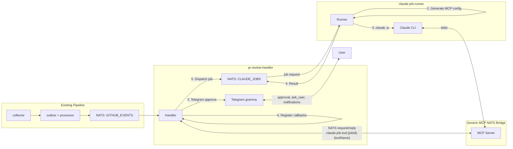
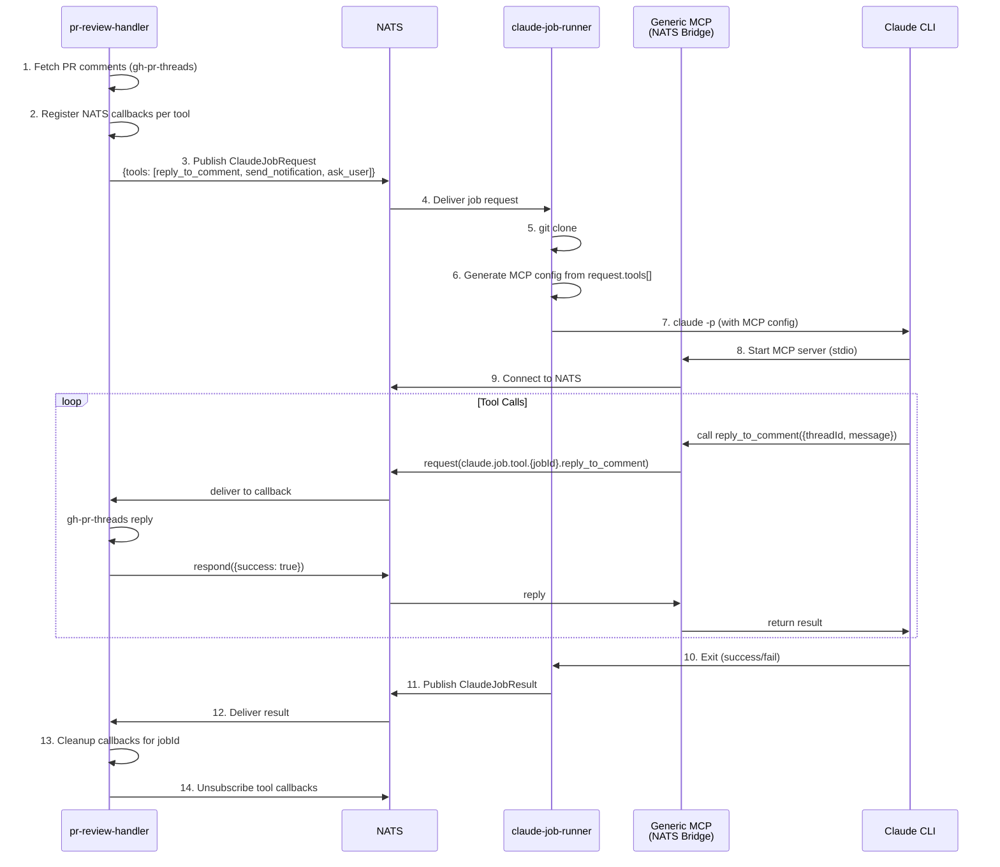
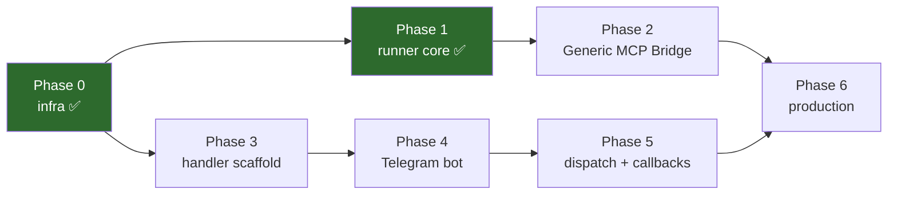
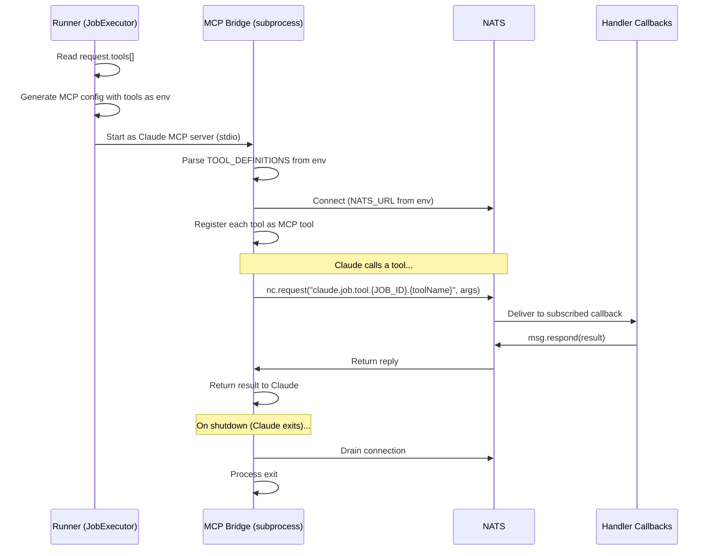
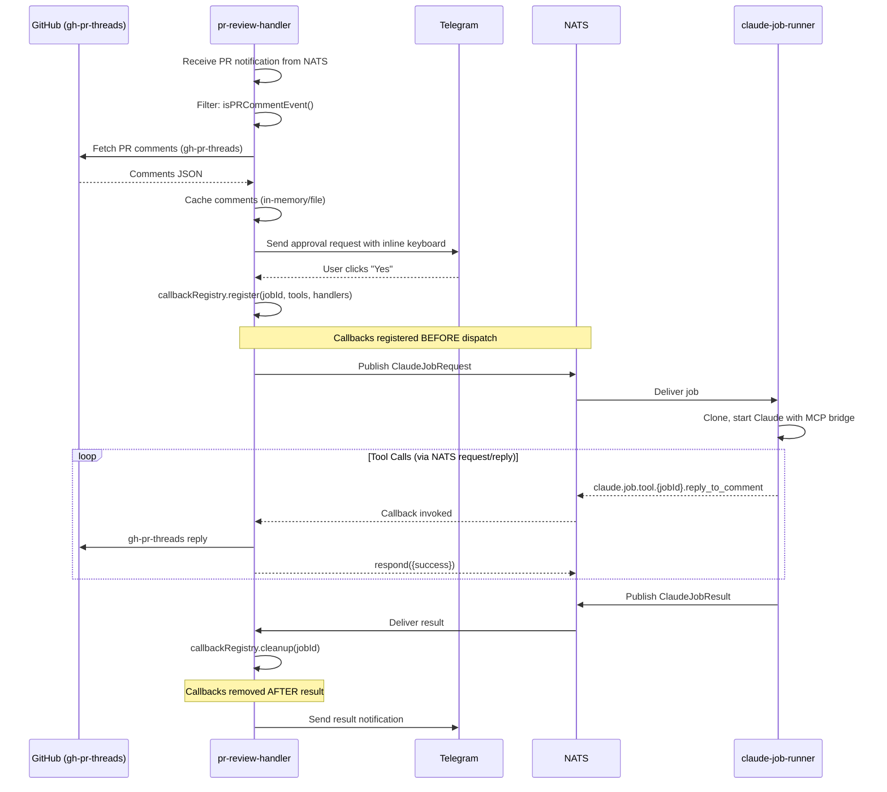

# MVP Roadmap: Claude Job Runner + PR Review Handler

## Context

Система GitHub-автоматизации уже имеет pipeline: `collector → outbox → event-processor-worker → NATS JetStream`. Нужны два новых сервиса:

1. **`claude-job-runner`** — generic исполнитель Claude-задач (получает job request из NATS, клонирует репо, запускает `claude -p`, возвращает результат)
2. **`pr-review-handler`** — диспетчер PR-комментариев (фильтрует NATS-события, запрашивает одобрение в Telegram, диспатчит job'ы, обрабатывает результаты)

**Ключевые решения из брейншторма:**
- Разделение на 2 сервиса (generic runner + тонкий диспетчер)
- **Generic MCP → NATS Bridge**: один универсальный MCP server, tools определяются динамически per-job через `ToolDefinition[]` в `ClaudeJobRequest`
- **Handler-side data fetching**: комментарии из PR получаются на стороне `pr-review-handler` и передаются в промпте; ответы на комментарии — через MCP tool callbacks
- **NATS request/reply** для синхронных tool calls (Claude → MCP → NATS request → Handler callback → NATS reply → MCP → Claude)
- grammy для Telegram бота с inline keyboards и auth whitelist
- `git clone` вместо worktree (в контейнере нет основного репо)
- Claude CLI через `npm i -g @anthropic-ai/claude-code` + ANTHROPIC_API_KEY
- Docker volume для кеша (`/data/cache/`)
- Доступы Claude настраиваются per-job (tools, model, dynamic MCP tools)
- Telegram approval flow перед обработкой PR (кнопки Да/Нет)
- **Гарантированный cleanup callbacks**: NATS subscriptions привязаны к connection lifecycle + explicit unsubscribe per-job + TTL safety net
---

## Архитектура



### Generic MCP → NATS Bridge (ключевая архитектурная идея)

MCP server — тонкий NATS proxy. Tools определяются **динамически** из `ClaudeJobRequest.tools[]`.



**Handler регистрирует callbacks ДО dispatch'а job'а, снимает ПОСЛЕ получения результата.**

## NATS Subjects

| Subject | Pattern | Publisher | Consumer | Механизм |
|---------|---------|-----------|----------|----------|
| `github.notification.created` | JetStream | event-processor-worker | pr-review-handler | consume |
| `github.notification.updated` | JetStream | event-processor-worker | pr-review-handler | consume |
| `claude.job.request.pr-review` | JetStream | pr-review-handler | claude-job-runner | consume |
| `claude.job.result.pr-review` | JetStream | claude-job-runner | pr-review-handler | consume |
| `claude.job.tool.<jobId>.<toolName>` | **request/reply** | MCP server | pr-review-handler | `nc.request()` / `nc.subscribe()` |

**Важно:** Tool calls используют NATS request/reply (не JetStream) — это синхронный паттерн, идеально подходит для tool calls где Claude ждёт ответа.

## Callback Cleanup Guarantees

Гарантированное снятие callbacks — критически важно. Три уровня защиты:

```mermaid
graph TB
    subgraph "Level 1: NATS Connection Lifecycle (auto)"
        CRASH[Handler crash/OOM] --> CONN_DIES[NATS connection closes]
        CONN_DIES --> SUBS_DIE[All subscriptions removed]
        SUBS_DIE --> MCP_TIMEOUT[MCP gets timeout on request]
        MCP_TIMEOUT --> CLAUDE_ERR[Claude gets error]
    end

    subgraph "Level 2: Explicit Cleanup (primary)"
        RESULT[Job result received] --> CLEANUP["cleanup(jobId)"]
        CLEANUP --> UNSUB[Unsubscribe all job callbacks]
        UNSUB --> DELETE[Delete from activeCallbacks map]
        SHUTDOWN[SIGTERM/SIGINT] --> CLEANUP_ALL["cleanupAll()"]
        CLEANUP_ALL --> UNSUB_ALL[Unsubscribe ALL callbacks]
    end

    subgraph "Level 3: TTL Safety Net"
        REGISTER[Register callbacks] --> TIMER["setTimeout(JOB_TTL_MS)"]
        TIMER --> CHECK{Job still active?}
        CHECK -->|Yes| FORCE["Force cleanup(jobId)"]
        CHECK -->|No| NOOP[Already cleaned up]
    end
```



### CallbackRegistry (реализация в Phase 5)

```typescript
class CallbackRegistry {
  private activeCallbacks = new Map<string, NatsSubscription[]>();

  // Регистрация callbacks ПЕРЕД dispatch'ем job'а
  async register(jobId: string, tools: ToolDefinition[], handlers: ToolHandlers): Promise<void> {
    const subs: NatsSubscription[] = [];
    for (const tool of tools) {
      const sub = nc.subscribe(`claude.job.tool.${jobId}.${tool.name}`, {
        callback: (err, msg) => {
          const args = JSON.parse(msg.data);
          handlers[tool.name](args)
            .then(result => msg.respond(JSON.stringify(result)))
            .catch(error => msg.respond(JSON.stringify({ error: error.message })));
        }
      });
      subs.push(sub);
    }
    this.activeCallbacks.set(jobId, subs);

    // Level 3: TTL safety net
    setTimeout(() => {
      if (this.activeCallbacks.has(jobId)) {
        logger.warn({ jobId }, 'TTL expired, force cleanup callbacks');
        this.cleanup(jobId);
      }
    }, JOB_TTL_MS); // e.g. 30 min
  }

  async cleanup(jobId: string): Promise<void> { /* unsubscribe + delete from map */ }
  async cleanupAll(): Promise<void> { /* unsubscribe ALL on shutdown */ }
}
```

### Матрица сценариев

| Сценарий | Что происходит | Cleanup level |
|----------|---------------|---------------|
| Job completed (success) | Handler получает result → `cleanup(jobId)` | Level 2 (explicit) |
| Job failed/timeout | Handler получает result → `cleanup(jobId)` | Level 2 (explicit) |
| Handler crash | NATS connection dies → subscriptions auto-removed | Level 1 (auto) |
| Runner crash | Claude dies → MCP dies → callbacks ждут до TTL | Level 3 (TTL) |
| MCP server crash | Claude gets error → job fails → result → cleanup | Level 2 |
| Handler restart | Старые subscriptions умерли с connection | Level 1 (auto) |
| Зависший job | TTL expires → force cleanup | Level 3 (TTL) |

## Зависимости между фазами



Phase 1 и Phase 3 можно делать параллельно после Phase 0.

---

## Phase 0: Infrastructure — packages/nats multi-stream + shared-types job types ✅ DONE

**Status:** Завершена. PR: feature/phase-0-nats-multi-stream

**Goal:** Подготовить общие пакеты для поддержки нескольких NATS стримов и типов job'ов.

**Файлы для модификации:**
- `packages/nats/src/stream-config.ts` — добавить CLAUDE_JOBS stream config + helper type
- `packages/nats/src/publisher.ts` — параметризовать stream (optional, default = GITHUB_EVENTS)
- `packages/nats/src/subscriber.ts` — параметризовать stream (optional, default = GITHUB_EVENTS)
- `packages/nats/src/factory.ts` — optional stream param в фабрики
- `packages/nats/src/index.ts` — export новых типов

**Файлы для создания:**
- `packages/shared-types/src/jobs/job-type.enum.ts`
- `packages/shared-types/src/jobs/tool-definition.ts`
- `packages/shared-types/src/jobs/claude-job-request.ts`
- `packages/shared-types/src/jobs/claude-job-result.ts`
- `packages/shared-types/src/jobs/index.ts`

### Ключевые типы

```typescript
// packages/shared-types/src/jobs/job-type.enum.ts
export enum JobType {
  PR_REVIEW = 'pr-review',
}

// packages/shared-types/src/jobs/tool-definition.ts
export interface ToolDefinition {
  name: string;
  description: string;
  inputSchema: Record<string, unknown>;  // JSON Schema
  timeoutMs?: number;  // default 30s; ask_user = 300_000
}

// packages/shared-types/src/jobs/claude-job-request.ts
export interface ClaudeJobRequest {
  jobId: string;
  jobType: JobType;
  prompt: string;
  repository: {
    url: string;       // https://github.com/owner/repo.git
    branch?: string;   // конкретная ветка для clone
    cloneDepth?: number; // --depth (default: 0 = full)
  };
  claude: {
    model?: string;           // sonnet, opus, haiku
    maxTurns?: number;        // --max-turns
    maxBudgetUsd?: number;    // --max-budget-usd
    timeoutMs?: number;
    allowedTools?: string[];  // --allowedTools
    permissionMode?: string;  // --permission-mode
    mcpServers?: Record<string, McpServerConfig>; // дополнительные статические MCP
  };
  tools?: ToolDefinition[];   // динамические tools для Generic MCP Bridge
  metadata: Record<string, unknown>;
  createdAt: string;
}

interface McpServerConfig {
  command: string;
  args?: string[];
  env?: Record<string, string>;
}

// packages/shared-types/src/jobs/claude-job-result.ts
export interface ClaudeJobResult {
  jobId: string;
  jobType: JobType;
  status: 'completed' | 'failed' | 'timeout';
  result?: {
    summary: string;
    output: string;
    exitCode: number;
  };
  error?: {
    message: string;
    exitCode?: number;
  };
  timing: {
    startedAt: string;
    completedAt: string;
    durationMs: number;
  };
  metadata: Record<string, unknown>;
}
```

> **Убрано из предыдущей версии:**
> - `communication` — заменено на `tools[]` (generic MCP bridge)
> - `cache` — кеш теперь на стороне handler'а, runner не управляет кешем
> - `ClaudeJobComm` — больше не нужен, tool calls идут через NATS request/reply

### Модификация NatsPublisher

```typescript
// Текущее: constructor(js, jsm, logger) — хардкод STREAM_NAME/STREAM_CONFIG
// Новое: constructor(js, jsm, logger, streamConfig?) — optional, default GITHUB_EVENTS

export interface StreamConfig {
  name: string;
  subjects: string[];
  max_age: bigint;
  max_msgs: number;
  storage: 'file' | 'memory';
  num_replicas: number;
}

// factory.ts
export async function createNatsPublisher(
  nc: NatsConnection, logger: Logger, streamConfig?: StreamConfig
): Promise<NatsPublisher>

export async function createNatsSubscriber(
  nc: NatsConnection, logger: Logger, streamName?: string
): Promise<NatsSubscriber>
```

### Backward Compatibility

- `event-processor-worker` вызывает `createNatsPublisher(nc, logger)` без stream param -> работает как раньше (default = GITHUB_EVENTS)
- Новые сервисы передают `createNatsPublisher(nc, logger, CLAUDE_JOBS_STREAM_CONFIG)`

### Тесты

- `packages/nats/src/__tests__/publisher.test.ts` — проверить что custom stream config используется
- `packages/nats/src/__tests__/subscriber.test.ts` — проверить что custom stream name используется
- `packages/shared-types` — нет runtime логики, только типы

### Верификация

1. `pnpm build` — все пакеты собираются
2. `pnpm --filter @gh-automation/event-processor-worker test run` — существующие тесты не сломались
3. `pnpm --filter @gh-automation/nats test run` — новые тесты проходят

---

## Phase 1: claude-job-runner — scaffold + core ✅ DONE

**Status:** Завершена. PR: https://github.com/fixcik/gh-automation/pull/8

**Goal:** Сервис получает job request из NATS, клонирует репо, запускает `claude -p`, возвращает результат.

**Файлы для создания:**
```
apps/claude-job-runner/
  package.json
  tsconfig.json
  vitest.config.ts
  src/
    index.ts                     # Entry point, NATS lifecycle, shutdown
    config.ts                    # Env parsing
    clone-manager.ts             # git clone + cleanup
    claude-runner.ts             # claude -p invocation via execa
    claude-config-builder.ts     # Генерация CLI args + MCP config JSON
    job-consumer.ts              # NATS consumer loop + msg.working() heartbeat
    job-executor.ts              # Orchestrator: clone -> claude -> publish result
    __tests__/
      config.test.ts
      clone-manager.test.ts
      claude-config-builder.test.ts
      claude-runner.test.ts
      job-executor.test.ts
      job-consumer.test.ts
```

### Ключевые компоненты

**CloneManager:**
```typescript
class CloneManager {
  constructor(baseDir: string, logger: Logger) {}

  // git clone --branch <branch> [--depth N] <url> <path>
  async clone(repo: ClaudeJobRequest['repository']): Promise<string>  // returns clone path

  // rm -rf <path>
  async cleanup(clonePath: string): Promise<void>
}
```
Путь клона: `<baseDir>/job-<jobId>/`

> **Убрано:** `restoreCache` / `saveCache` — кеш теперь на стороне handler'а.

**ClaudeConfigBuilder:**
```typescript
class ClaudeConfigBuilder {
  // Генерирует CLI аргументы из ClaudeJobRequest.claude
  buildArgs(config: ClaudeJobRequest['claude']): string[]

  // Генерирует .mcp.json для job'а
  // Включает Generic MCP Bridge (если есть tools) + дополнительные статические MCP из request
  buildMcpConfig(options: {
    jobId: string;
    tools: ToolDefinition[];
    bridgeCommand: string;
    natsUrl: string;
    extraServers?: Record<string, McpServerConfig>;
    configDir: string;
  }): Promise<string>  // returns path to config file
}
```

Результат `buildArgs`:
```
['-p', '--allowedTools', 'Edit,Write,...', '--max-budget-usd', '5',
 '--model', 'sonnet', '--max-turns', '50', '--permission-mode', 'bypassPermissions']
```

**ClaudeRunner:**
```typescript
class ClaudeRunner {
  constructor(logger: Logger) {}

  async run(prompt: string, cwd: string, args: string[], timeoutMs: number): Promise<ClaudeResult>
}
```
Использует `execa('claude', args, { cwd, input: prompt, timeout })`.

**JobConsumer:**
```typescript
class JobConsumer {
  constructor(subscriber: NatsSubscriber, logger: Logger, config: ConsumerConfig) {}

  async init(): Promise<void>           // ensureConsumer
  async listen(handler: JobHandler): Promise<void>  // consume loop + msg.working() heartbeat
  async stop(): Promise<void>           // close consumer messages
}
```

Heartbeat: `setInterval(() => msg.working(), 30_000)` — очищается после обработки.

**JobExecutor:**
```typescript
class JobExecutor {
  constructor(cloneManager, claudeRunner, claudeConfigBuilder, publisher, logger) {}

  async execute(request: ClaudeJobRequest): Promise<ClaudeJobResult>
  // 1. clone repo
  // 2. build claude args + MCP config (with dynamic tools from request.tools[])
  // 3. run claude
  // 4. publish result to NATS (claude.job.result.<jobType>)
  // 5. cleanup clone (finally)
}
```

### Environment Variables

```bash
NATS_URL=nats://localhost:4222
NATS_CONSUMER_NAME=claude-job-runner
NATS_ACK_WAIT_MS=900000          # 15 min (Claude может работать долго)
CLONE_BASE_DIR=/tmp/claude-jobs
LOG_LEVEL=info
```

### Тесты

| Файл | Что тестируем |
|------|--------------|
| config.test.ts | defaults, env parsing, invalid values |
| clone-manager.test.ts | buildClonePath, buildCloneArgs |
| claude-config-builder.test.ts | buildArgs, buildMcpConfig JSON structure |
| claude-runner.test.ts | buildArgs (unit), не вызываем execa |
| job-executor.test.ts | full flow с моками (clone -> claude -> result -> cleanup) |
| job-consumer.test.ts | ensureConsumer config, parseMessage |

### Верификация

1. `pnpm --filter @gh-automation/claude-job-runner build`
2. `pnpm --filter @gh-automation/claude-job-runner test run`
3. Ручной тест: опубликовать job request в NATS -> runner должен подхватить, склонировать, попытаться запустить claude

---

## Phase 2: Generic MCP → NATS Bridge

**Goal:** Универсальный MCP server — тонкий NATS proxy. Tools определяются динамически из env (передаётся `ClaudeJobRequest.tools[]`). Любой handler может зарегистрировать свои callbacks.

**Файлы для создания:**
```
apps/claude-job-runner/
  src/
    mcp-bridge/
      index.ts              # Standalone stdio MCP server entry point
      nats-tool-proxy.ts    # Dynamic tool registration + NATS request/reply
    __tests__/
      nats-tool-proxy.test.ts
```

**Зависимости:** `@modelcontextprotocol/sdk`, `@nats-io/nats-core`

### Как это работает



### MCP Config (генерируется ClaudeConfigBuilder)

```json
{
  "mcpServers": {
    "job-bridge": {
      "command": "node",
      "args": ["/app/apps/claude-job-runner/dist/mcp-bridge/index.js"],
      "env": {
        "NATS_URL": "nats://nats:4222",
        "JOB_ID": "abc-123",
        "TOOL_DEFINITIONS": "[{\"name\":\"reply_to_comment\",\"description\":\"...\",\"inputSchema\":{...},\"timeoutMs\":30000}]"
      }
    }
  }
}
```

### NatsToolProxy (ядро)

```typescript
class NatsToolProxy {
  constructor(
    private nc: NatsConnection,
    private jobId: string,
    private logger: Logger
  ) {}

  /**
   * Регистрирует tools на MCP server.
   * Каждый tool при вызове делает NATS request и ждёт reply.
   */
  registerTools(server: McpServer, tools: ToolDefinition[]): void {
    for (const tool of tools) {
      server.tool(tool.name, tool.description, tool.inputSchema, async (args) => {
        const subject = `claude.job.tool.${this.jobId}.${tool.name}`;
        const timeout = tool.timeoutMs ?? 30_000;

        try {
          const reply = await this.nc.request(subject, JSON.stringify(args), { timeout });
          return JSON.parse(reply.data);
        } catch (error) {
          if (error.code === 'TIMEOUT') {
            return { error: `Tool ${tool.name} timed out after ${timeout}ms` };
          }
          return { error: error.message };
        }
      });
    }
  }

  /** Graceful shutdown: drain NATS connection */
  async shutdown(): Promise<void> {
    await this.nc.drain();
  }
}
```

### Entry point (index.ts)

```typescript
// 1. Parse env
const jobId = process.env.JOB_ID!;
const natsUrl = process.env.NATS_URL!;
const tools: ToolDefinition[] = JSON.parse(process.env.TOOL_DEFINITIONS!);

// 2. Connect to NATS
const nc = await connect({ servers: natsUrl });

// 3. Create MCP server
const server = new McpServer({ name: 'job-bridge', version: '1.0.0' });
const proxy = new NatsToolProxy(nc, jobId, logger);

// 4. Register tools dynamically
proxy.registerTools(server, tools);

// 5. Start stdio transport
const transport = new StdioServerTransport();
await server.connect(transport);

// 6. Cleanup on exit (CRITICAL)
const cleanup = async () => {
  await proxy.shutdown();
  process.exit(0);
};
process.on('SIGTERM', cleanup);
process.on('SIGINT', cleanup);
process.on('beforeExit', cleanup);
```

### Модификация ClaudeConfigBuilder (Phase 1)

Обновить `buildMcpConfig` для генерации bridge конфига из `request.tools[]`:

```typescript
async buildMcpConfig(options: {
  jobId: string;
  tools: ToolDefinition[];        // ← NEW: dynamic tools
  bridgeCommand: string;          // path to mcp-bridge/index.js
  natsUrl: string;
  extraServers?: Record<string, McpServerConfig>;
  configDir: string;
}): Promise<string> {
  const mcpConfig: Record<string, McpServerConfig> = {};

  // Add generic bridge MCP (only if tools defined)
  if (options.tools.length > 0) {
    mcpConfig['job-bridge'] = {
      command: 'node',
      args: [options.bridgeCommand],
      env: {
        NATS_URL: options.natsUrl,
        JOB_ID: options.jobId,
        TOOL_DEFINITIONS: JSON.stringify(options.tools),
      },
    };
  }

  // Add extra static MCP servers
  if (options.extraServers) {
    Object.assign(mcpConfig, options.extraServers);
  }

  // Write .mcp.json
  const configPath = join(options.configDir, '.mcp.json');
  await writeFile(configPath, JSON.stringify({ mcpServers: mcpConfig }, null, 2));
  return configPath;
}
```

### Тесты

| Файл | Что тестируем |
|------|--------------|
| nats-tool-proxy.test.ts | registerTools создаёт tools, NATS request/reply с mock, timeout handling, error handling |

### Верификация

1. `pnpm --filter @gh-automation/claude-job-runner build` — MCP bridge компилируется
2. Unit тесты: proxy корректно маршрутизирует tool calls в NATS
3. Ручной тест: запустить MCP bridge с env vars → вызвать tool через MCP protocol → проверить NATS request

---

## Phase 3: pr-review-handler — scaffold + NATS listener

**Goal:** Сервис подписывается на GITHUB_EVENTS, фильтрует PR-комментарии, дедуплицирует.

**Файлы для создания:**
```
apps/pr-review-handler/
  package.json
  tsconfig.json
  vitest.config.ts
  src/
    index.ts                          # Entry point
    config.ts                         # Env parsing
    nats/
      notification-listener.ts        # NATS consumer на GITHUB_EVENTS
      event-filter.ts                 # isPRCommentEvent
    dedup/
      deduplication-guard.ts          # In-memory lock + cooldown
    __tests__/
      config.test.ts
      event-filter.test.ts
      deduplication-guard.test.ts
      notification-listener.test.ts
```

### Ключевые компоненты

**EventFilter:** (идентичен монолитному плану)
```typescript
function isPRCommentEvent(payload: GithubNotificationEvent['payload']): boolean {
  return (
    payload.subjectType === SubjectType.PULL_REQUEST &&
    ['comment', 'mention'].includes(payload.reason) &&  // НЕ review_requested
    payload.subjectNumber !== null
  );
}
```

**DeduplicationGuard:** in-memory Map с cooldown + in-flight tracking.

**NotificationListener:** обёртка над NatsSubscriber для GITHUB_EVENTS стрима.

### Environment Variables

```bash
NATS_URL=nats://localhost:4222
NATS_CONSUMER_NAME=pr-review-handler
NATS_ACK_WAIT_MS=600000
PR_HANDLER_COOLDOWN_MS=300000
LOG_LEVEL=info
```

### Тесты

Те же что в монолитном плане 1: config (3), event-filter (7), dedup-guard (7), listener (3) = ~20 тестов.

### Верификация

1. `pnpm --filter @gh-automation/pr-review-handler build`
2. `pnpm --filter @gh-automation/pr-review-handler test run`
3. Ручной: подключиться к NATS -> слушать события -> логировать отфильтрованные PR events

---

## Phase 4: pr-review-handler — Telegram bot

**Goal:** grammy бот с auth whitelist, approval flow (inline buttons), отправка уведомлений, relay для ask_user.

**Файлы для создания:**
```
apps/pr-review-handler/
  src/
    telegram/
      bot.ts                    # grammy Bot instance, middleware, long-polling
      auth-middleware.ts         # Whitelist по user ID
      approval-handler.ts       # Inline keyboard: "Обработать PR? Да/Нет"
      notification-sender.ts    # Отправка уведомлений (результаты, ошибки)
      message-formatter.ts      # Форматирование HTML для Telegram
    __tests__/
      auth-middleware.test.ts
      approval-handler.test.ts
      message-formatter.test.ts
      notification-sender.test.ts
```

**Зависимость:** `grammy`

### Ключевые компоненты

**AuthMiddleware:**
```typescript
// Whitelist из env: TELEGRAM_ALLOWED_USERS=123456,789012
function authMiddleware(allowedUserIds: number[]): MiddlewareFn {
  return (ctx, next) => {
    if (!allowedUserIds.includes(ctx.from?.id ?? 0)) {
      return; // молча игнорируем
    }
    return next();
  };
}
```

**ApprovalHandler:**
```typescript
// При получении PR event -> отправить сообщение с inline keyboard
async function sendApprovalRequest(bot, chatId, payload): Promise<void> {
  await bot.api.sendMessage(chatId, formatApprovalMessage(payload), {
    parse_mode: 'HTML',
    reply_markup: {
      inline_keyboard: [[
        { text: 'Yes', callback_data: `approve:${repository}:${prNumber}` },
        { text: 'No', callback_data: `reject:${repository}:${prNumber}` },
      ]],
    },
  });
}

// Callback handler
bot.callbackQuery(/^approve:(.+):(\d+)$/, async (ctx) => {
  // -> dispatch job
  await ctx.answerCallbackQuery('Launching processing...');
  await ctx.editMessageReplyMarkup(undefined); // убрать кнопки
});
```

**AskUser relay (через Generic MCP Bridge):**
```typescript
// Claude вызывает tool `ask_user` → MCP Bridge → NATS request
// → Handler callback получает вопрос
// → Отправить в Telegram с force_reply
// → Получить ответ пользователя
// → NATS reply с ответом → MCP Bridge → Claude

// Реализация в Phase 5 (tool-handlers.ts → ask_user callback)
```

**NotificationSender:**
```typescript
class NotificationSender {
  async sendResult(report: ClaudeJobResult): Promise<void>  // статистика + ссылка на PR
  async sendError(context, error: Error): Promise<void>
  async sendProgress(jobId: string, status: string): Promise<void>
}
```

### Environment Variables

```bash
TELEGRAM_BOT_TOKEN=123456:ABC-xxx
TELEGRAM_CHAT_ID=-100xxx
TELEGRAM_ALLOWED_USERS=123456,789012   # user IDs через запятую
```

### Тесты

| Файл | Что тестируем |
|------|--------------|
| auth-middleware.test.ts | allowed user passes, unknown user blocked |
| approval-handler.test.ts | callback_data format, approve/reject parsing |
| message-formatter.test.ts | HTML formatting, truncation, escaping |
| notification-sender.test.ts | send with mock bot API |

### Верификация

1. `pnpm --filter @gh-automation/pr-review-handler test run`
2. Ручной: запустить бот -> отправить `/start` -> проверить auth -> отправить тестовое approval -> нажать кнопку

---

## Phase 5: pr-review-handler — job dispatch + callbacks + result handling

**Goal:** Связать всё: получить комментарии → Telegram approval → зарегистрировать callbacks → dispatch job → обработать tool calls → обработать результат.

**Файлы для создания:**
```
apps/pr-review-handler/
  src/
    jobs/
      comment-fetcher.ts         # Получение комментариев через gh-pr-threads
      prompt-builder.ts          # Генерация промпта с комментариями
      tool-definitions.ts        # ToolDefinition[] для PR review job'ов
      callback-registry.ts       # Регистрация/снятие NATS callbacks per-job
      tool-handlers.ts           # Реализации callbacks (reply_to_comment, send_notification, ask_user)
      job-dispatcher.ts          # Создать ClaudeJobRequest, register callbacks, publish
      result-handler.ts          # NATS consumer на claude.job.result.pr-review
    __tests__/
      comment-fetcher.test.ts
      prompt-builder.test.ts
      tool-definitions.test.ts
      callback-registry.test.ts
      tool-handlers.test.ts
      job-dispatcher.test.ts
      result-handler.test.ts
```

### Flow



### Ключевые компоненты

**CommentFetcher:** (получение комментариев на стороне handler'а)
```typescript
class CommentFetcher {
  /** Получает комментарии через gh-pr-threads CLI */
  async fetch(repository: string, prNumber: number): Promise<PrThreads> {
    const { stdout } = await execa('npx', [
      'gh-pr-threads',
      `https://github.com/${repository}/pull/${prNumber}`,
      '--json'
    ]);
    return JSON.parse(stdout);
  }
}
```

**PromptBuilder:** (комментарии уже в промпте)
```typescript
function buildPrompt(repository: string, prNumber: number, comments: PrThreads): string {
  return `
## Задача
Обработай комментарии к PR #${prNumber} в репозитории ${repository}.

## Комментарии
${JSON.stringify(comments, null, 2)}

## Инструкции
1. Для каждого комментария проанализируй что нужно исправить
2. Внеси исправления в код
3. Используй tool \`reply_to_comment\` чтобы ответить на каждый комментарий
4. Используй tool \`send_notification\` для отправки прогресса
5. Если что-то непонятно — используй tool \`ask_user\`
6. Сделай git commit и push
  `.trim();
}
```

**ToolDefinitions:** (определения tools для PR review)
```typescript
const PR_REVIEW_TOOLS: ToolDefinition[] = [
  {
    name: 'reply_to_comment',
    description: 'Reply to a PR review comment thread on GitHub',
    inputSchema: {
      type: 'object',
      properties: {
        threadId: { type: 'string', description: 'Thread ID from comments JSON' },
        message: { type: 'string', description: 'Reply message text' },
      },
      required: ['threadId', 'message'],
    },
    timeoutMs: 30_000,
  },
  {
    name: 'send_notification',
    description: 'Send a notification to the user via Telegram',
    inputSchema: {
      type: 'object',
      properties: {
        message: { type: 'string', description: 'Notification message' },
        level: { type: 'string', enum: ['info', 'warn', 'error'], default: 'info' },
      },
      required: ['message'],
    },
    timeoutMs: 10_000,
  },
  {
    name: 'ask_user',
    description: 'Ask the user a question and wait for their response via Telegram',
    inputSchema: {
      type: 'object',
      properties: {
        question: { type: 'string', description: 'Question to ask the user' },
      },
      required: ['question'],
    },
    timeoutMs: 300_000, // 5 min — ждём ответа пользователя
  },
];
```

**ToolHandlers:** (реализации callbacks)
```typescript
function createToolHandlers(deps: {
  commentFetcher: CommentFetcher;
  telegramBot: Bot;
  chatId: string;
  logger: Logger;
}): Record<string, (args: unknown) => Promise<unknown>> {
  return {
    reply_to_comment: async ({ threadId, message }) => {
      await execa('npx', ['gh-pr-threads', 'reply', threadId, message]);
      return { success: true };
    },

    send_notification: async ({ message, level }) => {
      await deps.telegramBot.api.sendMessage(
        deps.chatId,
        formatNotification(message, level)
      );
      return { success: true };
    },

    ask_user: async ({ question }) => {
      // Отправить вопрос в Telegram с force_reply
      const msg = await deps.telegramBot.api.sendMessage(
        deps.chatId,
        `Claude asks:\n${question}`,
        { reply_markup: { force_reply: true } }
      );
      // Ждать ответ (через Promise + bot.on('message') handler)
      const answer = await waitForReply(deps.telegramBot, msg.message_id, 300_000);
      return { answer };
    },
  };
}
```

**JobDispatcher:** (register callbacks → dispatch)
```typescript
class JobDispatcher {
  constructor(
    private publisher: NatsPublisher,
    private callbackRegistry: CallbackRegistry,
    private logger: Logger,
  ) {}

  async dispatch(
    payload: GithubNotificationEvent['payload'],
    comments: PrThreads,
    toolHandlers: ToolHandlers
  ): Promise<string> {
    const jobId = crypto.randomUUID();

    // 1. Register callbacks BEFORE dispatch (гарантия что callbacks готовы)
    await this.callbackRegistry.register(jobId, PR_REVIEW_TOOLS, toolHandlers);

    // 2. Build job request
    const request: ClaudeJobRequest = {
      jobId,
      jobType: JobType.PR_REVIEW,
      prompt: buildPrompt(payload.repository, payload.subjectNumber!, comments),
      repository: {
        url: `https://github.com/${payload.repository}.git`,
        branch: await getBranchName(payload.repository, payload.subjectNumber!),
      },
      claude: {
        model: 'sonnet',
        maxTurns: 50,
        maxBudgetUsd: 5,
        timeoutMs: 300_000,
        allowedTools: ['Edit', 'Write', 'Read', 'Glob', 'Grep', 'Bash(git:*)'],
        permissionMode: 'bypassPermissions',
      },
      tools: PR_REVIEW_TOOLS,  // ← dynamic MCP tools
      metadata: {
        repository: payload.repository,
        prNumber: payload.subjectNumber,
        prTitle: payload.subjectTitle,
        reason: payload.reason,
      },
      createdAt: new Date().toISOString(),
    };

    // 3. Publish
    await this.publisher.publish({
      eventId: jobId,
      eventType: `claude.job.request.${JobType.PR_REVIEW}`,
      aggregateId: `${payload.repository}:${payload.subjectNumber}`,
      payload: request,
    });

    return jobId;
  }
}
```

**ResultHandler:** (cleanup callbacks on result)
```typescript
class ResultHandler {
  constructor(
    private callbackRegistry: CallbackRegistry,
    private notificationSender: NotificationSender,
    private logger: Logger,
  ) {}

  async handle(result: ClaudeJobResult): Promise<void> {
    // 1. ВСЕГДА cleanup callbacks (даже если notification fail)
    await this.callbackRegistry.cleanup(result.jobId);

    // 2. Send Telegram notification
    if (result.status === 'completed') {
      await this.notificationSender.sendResult(result);
    } else {
      await this.notificationSender.sendError(result);
    }
  }
}
```

### Wiring в index.ts

```typescript
// 1. NotificationListener (GITHUB_EVENTS) -> filter -> fetch comments -> approval
// 2. ResultHandler (CLAUDE_JOBS, claude.job.result.pr-review) -> cleanup + Telegram

await Promise.all([
  notificationListener.listen(approvalFlow),
  resultHandler.listen(),
]);

// Shutdown: cleanup ALL active callbacks
process.on('SIGTERM', async () => {
  await callbackRegistry.cleanupAll();
  await closeNatsConnection(logger);
});
```

### Тесты

| Файл | Что тестируем |
|------|--------------|
| comment-fetcher.test.ts | парсинг gh-pr-threads output, error handling |
| prompt-builder.test.ts | содержит repo, PR #, comments JSON, tool instructions |
| tool-definitions.test.ts | schemas валидны, timeouts корректны |
| callback-registry.test.ts | register, cleanup, cleanupAll, TTL expiry |
| tool-handlers.test.ts | reply_to_comment вызывает execa, send_notification вызывает bot |
| job-dispatcher.test.ts | register callbacks перед publish, формат ClaudeJobRequest |
| result-handler.test.ts | cleanup вызывается всегда, Telegram notification |

### Верификация

1. `pnpm --filter @gh-automation/pr-review-handler test run`
2. E2E: publish test event → handler fetch comments → Telegram → approve → callbacks registered → job dispatched → tool calls work → result → cleanup

---

## Phase 6: Production — Docker + compose

**Goal:** Контейнеризация обоих сервисов, интеграция в docker-compose.

### claude-job-runner Dockerfile

Особенности:
- Runtime: `git`, `gh` CLI, `claude` CLI (`npm i -g @anthropic-ai/claude-code`)
- MCP Bridge: `@modelcontextprotocol/sdk` (уже в dependencies)
- Volume mount: `/tmp/claude-jobs` для клонов (tmpfs рекомендуется)
- `GH_TOKEN` и `ANTHROPIC_API_KEY` через env
- **Нет cache volume** — кеш на стороне handler'а

### pr-review-handler Dockerfile

Особенности:
- Node.js runtime + `gh` CLI (для `gh pr view` и `gh-pr-threads`)
- grammy long-polling (не нужен incoming webhook)
- **Persistent storage для PR processing state** (см. ниже)

### PR Processing State (TODO: выбрать хранилище)

Handler хранит **персистентный стейт per-PR**: какие нитпики обработаны, скипнуты, failed. Это нужно чтобы при повторном запуске не обрабатывать уже обработанные комментарии.

```typescript
interface PrProcessingState {
  repository: string;
  prNumber: number;
  threads: Record<string, {   // key = threadId
    status: 'processed' | 'skipped' | 'failed';
    processedAt: string;
    jobId: string;             // в рамках какого job'а обработано
    summary?: string;          // краткий результат
  }>;
  lastUpdated: string;
}
```

**Варианты хранилища:**
| Вариант | Плюсы | Минусы | MVP? |
|---------|-------|--------|------|
| File-based (JSON per PR) | Просто, Docker volume | Не масштабируется, нет конкурентного доступа | Да |
| SQLite | Быстро, персистентно, SQL | Доп. зависимость | Возможно |
| PostgreSQL (existing) | Уже есть в стеке, масштабируется | Нужна миграция, overhead для простых данных | Позже |
| NATS KV | Уже есть NATS, key-value API | Не предназначен для сложных запросов | Возможно |

**Для MVP рекомендация:** File-based JSON — `/data/pr-state/{owner}_{repo}_pr-{N}.json`, Docker volume для персистентности.

### docker-compose additions

```yaml
claude-job-runner:
  depends_on:
    nats: { condition: service_healthy }
  volumes:
    - ~/.config/gh:/home/app/.config/gh:ro
  environment:
    NATS_URL, ANTHROPIC_API_KEY, GH_TOKEN, CLONE_BASE_DIR, LOG_LEVEL

pr-review-handler:
  depends_on:
    nats: { condition: service_healthy }
  volumes:
    - ~/.config/gh:/home/app/.config/gh:ro
    - pr-state:/data/pr-state    # Persistent PR processing state
  environment:
    NATS_URL, TELEGRAM_BOT_TOKEN, TELEGRAM_CHAT_ID, TELEGRAM_ALLOWED_USERS, GH_TOKEN,
    PR_STATE_DIR=/data/pr-state, LOG_LEVEL
```

### .env.example additions

```bash
# Claude Job Runner
ANTHROPIC_API_KEY=sk-ant-xxx
CLONE_BASE_DIR=/tmp/claude-jobs

# PR Review Handler
TELEGRAM_BOT_TOKEN=123456:ABC-xxx
TELEGRAM_CHAT_ID=-100xxx
TELEGRAM_ALLOWED_USERS=123456
PR_STATE_DIR=/data/pr-state
```

### Верификация

1. `docker-compose build claude-job-runner pr-review-handler`
2. `docker-compose up -d nats`
3. `docker-compose up pr-review-handler` -> бот стартует, подключается к NATS
4. `docker-compose up claude-job-runner` -> runner стартует, ждёт job requests
5. E2E smoke test: collector -> processor -> NATS -> handler -> Telegram -> approve -> runner -> Claude -> result -> Telegram

---

## Порядок реализации (рекомендация)

1. **Phase 0** (1-2 часа) — быстрая подготовка инфраструктуры
2. **Phase 3** (2-3 часа) — handler scaffold (можно тестировать с NATS сразу)
3. **Phase 1** (3-4 часа) — runner core (самый объёмный)
4. **Phase 4** (2-3 часа) — Telegram bot
5. **Phase 5** (2-3 часа) — dispatch + results (связывает handler с runner)
6. **Phase 2** (3-4 часа) — MCP server (можно отложить, MVP работает без ask_user)
7. **Phase 6** (1-2 часа) — Docker (финализация)

**Итого MVP:** ~15-20 часов работы

## Ключевые файлы для переиспользования

| Файл | Что берём |
|------|-----------|
| `packages/nats/src/subscriber.ts` | NatsSubscriber API (ensureConsumer, getConsumer) |
| `packages/nats/src/publisher.ts` | NatsPublisher API (ensureStream, publish) |
| `packages/nats/src/factory.ts` | createNatsPublisher, createNatsSubscriber |
| `packages/nats/src/connection.ts` | getNatsConnection, closeNatsConnection |
| `apps/event-processor-worker/src/index.ts` | Lifecycle/shutdown pattern |
| `packages/shared-types/src/events/` | GithubNotificationEvent payload structure |
| `packages/shared-types/src/enums/` | SubjectType, NotificationReason |
| `packages/logger/src/logger.ts` | createLogger, Logger type |

## Что делать с устаревшими планами

После утверждения этого roadmap:
- Удалить `.claude/plans/pr-review/2026-02-06-pr-review-handler-{1,2,3,4}.md` (устарели)
- `golden-chasing-pike.md` — пометить как superseded
- `vast-foraging-wren.md` — пометить как superseded (заменён этим roadmap)
